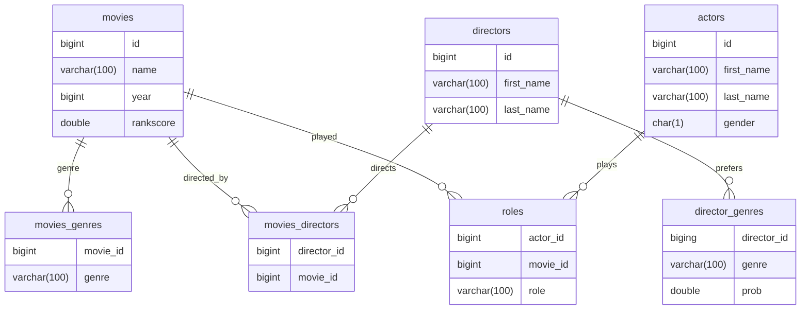

# ERD MOVIES SYSTEM

```mermaid
erDiagram

movies{
    bigint id
    varchar(100) name
    bigint year
    double rankscore
}

directors{
    bigint id
    varchar(100) first_name
    varchar(100) last_name
}

movies_genres{
    bigint movie_id
    varchar(100) genre
}

actors{
    bigint id
    varchar(100) first_name
    varchar(100) last_name
    char(1) gender
}

roles{
    bigint actor_id
    bigint movie_id
    varchar(100) role
}

director_genres{
    biging director_id
    varchar(100) genre
    double prob
}

movies_directors{
    bigint director_id
    bigint movie_id
}


directors ||--o{ movies_directors : "directs"
movies ||--o{ movies_directors : "directed_by"
directors ||--o{ director_genres : "prefers"
movies ||--o{ movies_genres : "genre"
actors ||--o{ roles : "plays"
movies ||--o{ roles : "played"


 
```